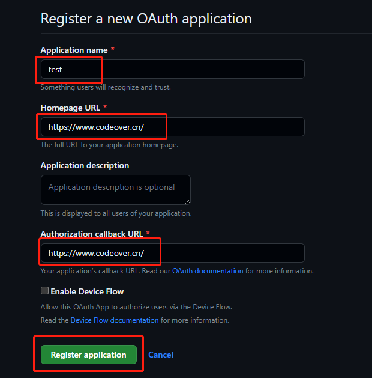

# 评论系统

## Gitalk 配置

更多关于 Gitalk 评论系统的信息，请访问 [Gitalk 官网](https://github.com/gitalk/gitalk/blob/master/readme-cn.md)

### 1. 获取 GitHub OAuth App

注册或登录 [GitHub](https://github.com/)，创建一个新的 [OAuth App](https://github.com/settings/applications/new)，其中 Homepage URL 和 Authorization callback URL 均填写自己的博客域名即可，Application name 可以随意填写。

OAuth App 创建成功后，把 Client ID 和 Client Secret 保存起来，下面要用到。



### 2. 新建 GitHub 仓库

回到 [GitHub](https://github.com/)，[创建一个新的*公开*仓库（repository）](https://github.com/new) 用来存放 Gitalk 评论，并打开 Issues，手动增加一个 Issue，内容随便填写即可

### 3. 填写配置

把自己的 GitHub 用户名、仓库名 、OAuth App 的 Client ID 、Client Secret 分别填写在主题配置文件里。

```yml
comment:
  config:
    gitalk:
      clientId: # 你的 Client ID
      clientSecret: # 你的 Client Secret
      repository: # 你的仓库名
      owner: # 你的 GitHub 用户名
      createIssueManually: true # 是否手动创建 Issue，如果为 true，则会显示一个初始化按钮，点击后才会创建 Issue
```

示例：
```yml title="_config.redefine.yml"
comment:
  config:
    gitalk:
      enable: true
      clientId: "eaa8ec37487184444514"
      clientSecret: "77f9955d0267c1331df7cc706cfa385d2beh1j41a"
      repository: blog
      owner: f-dong
      createIssueManually: true
```
