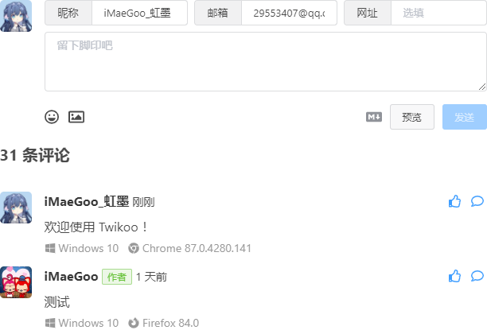
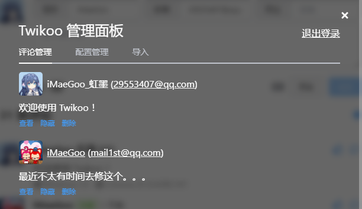
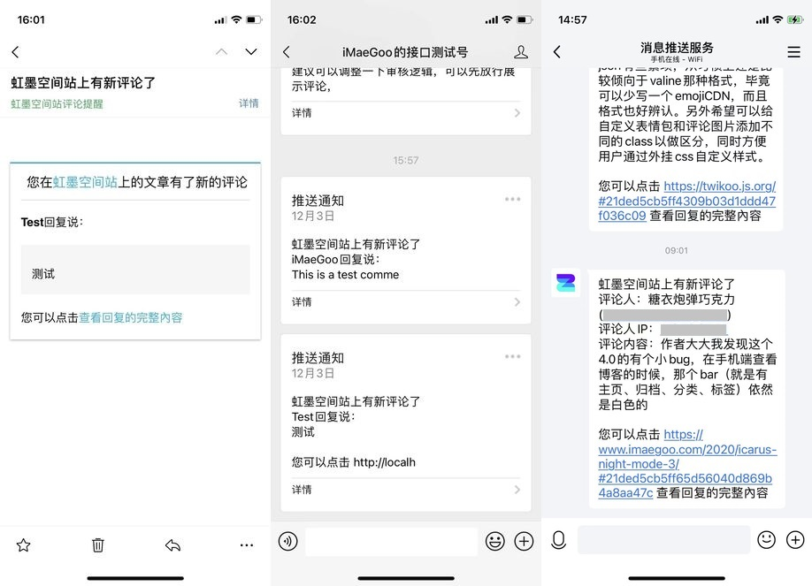

# 评论系统

## 开关

配置项名称：`comment.enable`

是否启用评论。

| 类型  | 可选值           | 默认值  |
|-----|---------------|------|
| 布尔值 | true \| false | true |

## 评论系统选择

配置项名称：`comment.system`

| 类型  | 可选值              | 默认值    |
|-----|------------------|--------|
| 字符串 | gitalk \| twikoo | twikoo |

## Twikoo 配置

配置项名称：`comment.config.twikoo`

请访问 [Twikoo 官网](https://twikoo.js.org/quick-start.html#vercel-%E9%83%A8%E7%BD%B2)，按照官网的指引配置好 Twikoo 服务端。（推荐使用 Vercel 部署方式）

拿到你需要的 `server_url` 后，填写到 `_config.minimalism.yml` 中。

```yml title="_config.minimalism.yml"
comment:
  enable: true
  system: twikoo
  config:
    twikoo:
      envId: "your envId" #  腾讯云环境填 envId；Vercel 环境填地址（https://xxx.vercel.app）
      region: # 环境地域，腾讯云传
      mark: # 一个twikoo服务端应用于多个内容时，可填写此项
```

:::tip
1. `region` 仅在使用腾讯云函数时需要填写，其他情况下可以不填。
2. vercel 默认域名在国内被墙，需要绑定自己的域名使用，如果你没有域名，可以 [邮件联系我](mailto:fdong26@gmail.com)，我可以提供一个域名给你使用。
3. 如果你不会配置 Twikoo 服务端，也可以 [邮件联系我](mailto:fdong26@gmail.com)，我会在闲暇时帮你配置（建议先查看 [Twikoo 官网](https://twikoo.js.org/quick-start.html#vercel-%E9%83%A8%E7%BD%B2)，作者提供有视频教程。）
:::

### 预览
#### 评论


#### 管理后台


#### 推送通知


## Gitalk 配置

配置项名称：`comment.config.gitalk`

更多关于 Gitalk 评论系统的信息，请访问 [Gitalk 官网](https://github.com/gitalk/gitalk/blob/master/readme-cn.md)

### 1. 获取 GitHub OAuth App

注册或登录 [GitHub](https://github.com/)，创建一个新的 [OAuth App](https://github.com/settings/applications/new)，其中 Homepage URL 和 Authorization callback URL 均填写自己的博客域名即可，Application name 可以随意填写。

OAuth App 创建成功后，把 Client ID 和 Client Secret 保存起来，下面要用到。


### 2. 新建 GitHub 仓库

回到 [GitHub](https://github.com/)，[创建一个新的*公开*仓库（repository）](https://github.com/new) 用来存放 Gitalk 评论，并打开 Issues，手动增加一个 Issue，内容随便填写即可

### 3. 填写配置

把自己的 GitHub 用户名、仓库名 、OAuth App 的 Client ID 、Client Secret 分别填写在主题配置文件里。

```yml
comment:
  config:
    gitalk:
      clientId:
      clientSecret:
      repository: # 仓库名
      owner: # 仓库所有者
      createIssueManually: false # 如果当前页面没有相应的 isssue 且登录的用户属于 admin，则会自动创建 issue。如果设置为 true，则显示一个初始化页面，创建 issue 需要点击 init 按钮。
```

示例：
```yml title="_config.minimalism.yml"
comment:
  enable: true
  system: gitalk
  config:
    gitalk:
      clientId: "eaa8ec37487184444514"
      clientSecret: "77f9955d0267c1331df7cc706cfa385d2beh1j41a"
      repository: blog
      owner: f-dong
      createIssueManually: true
```

:::tip

由于客观原因，国内有时无法访问 Github，因此 Gitalk 也可能会失效，如果你知道更好的评论系统，欢迎 [提交 issues](https://github.com/f-dong/hexo-theme-minimalism/issues/new/choose)，我会仔细评估并在后续版本中支持更多评论系统。

:::
