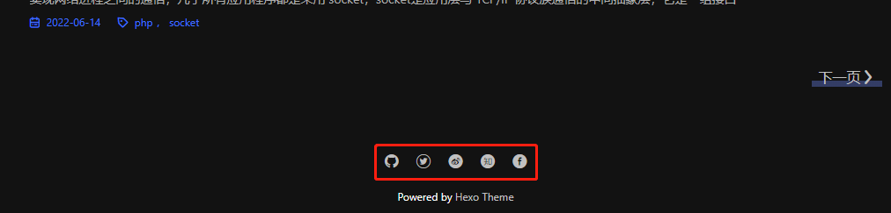

# 页脚


## 显示来源

配置项名称：`bottom_source.enable`

是否显示来源，开启后将在页脚显示 Powered by [Hexo](https://hexo.io/) [Theme](https://github.com/f-dong/hexo-theme-minimalism)，如不需要可将此项设置为 `false`

## 底部链接

配置项名称：`bottom_link`

用于自定义页面底部的链接，例如 ICP 备案号，格式如下

```yml
bottom_link:
  rss: # 随意定义，不重复即可
    url: # 跳转的地址
    text: #
  icp:
    url: # beian.miit.gov.cn
    text: # 沪ICP备 09007132号-1
```

例如，想在底部展示 ICP 备案号与公安备案号，可以这样填写

```yml
bottom_link:
  icp:
    url: "https://beian.miit.gov.cn"
    text: 豫ICP备2022011962号
  gongan:
    url: "http://www.beian.gov.cn/portal/registerSystemInfo?recordcode=41010402002848"
    text: 豫公网安备41010402002848号
```

## 联系方式

配置项名称：`contact`

用于在页面展示个人主页地址，格式如下，留空即代表不展示此链接，如果在如下列表中没有找到你想要的平台，可 [提交 issues](https://github.com/f-dong/hexo-theme-minimalism/issues/new/choose)

```yml
contact:
  github: "https://github.com/f-dong"
  twitter: 
  weibo: 
  zhihu: 
  facebook: 
```


