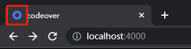
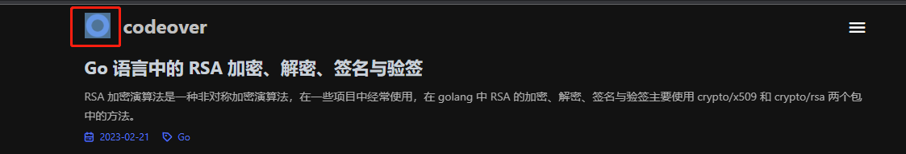

# 图片

## 站点图标

配置项名称：`favicon`，默认值：`/favicon.ico`

请写到你站点图标的路径，比如 /images/favicon.ico 或者外链 https://example.com/favicon.ico

图片格式必须为 `ico`，大小为 `16x16` 或 `32x32`，可以使用 [favicon.cc](https://www.favicon.cc/) 生成，如果你的站点图标是 `png` 格式，可以使用 [www.aconvert.com](https://www.aconvert.com/cn/icon/png-to-ico/) 转换。

注意，如果你的站点是 `https` 协议，那么站点图标必须也是 `https` 协议，否则浏览器会报错。

图标将显示在浏览器标签页上。

## 站点头像

配置项名称：`avatar`

请写到你站点头像的路径，比如 /images/avatar.png 或者外链 https://example.com/avatar.png

显示在导航栏左上角。

## 文章图片

配置项名称：`image`，默认值：`/images/avatar.png`

### 图片懒加载

配置项名称：`image.lazyload_enable`，默认值：`true`

是否开启图片懒加载，开启后图片将在滚动到可视区域时才加载，可以提升页面加载速度，开启设置为 `true`，关闭设置为 `false`。

### 图片懒加载占位图

配置项名称：`image.lazyload_placeholder` ，默认值：`/images/loading.svg`

图片懒加载占位图，可以是本地图片或者外链图片，如果不设置则使用默认占位图。

默认值占位图：

## 图片放大

配置项名称：`image.photo_zoom`，默认值：`simple-lightbox`

图片放大效果，目前支持 [simple-lightbox](https://simplelightbox.com/) 和 [fancybox](https://fancyapps.com/)，你可以点击对应的链接查看效果，如果不需要图片放大效果，设置为 `false` 即可。

注：fancybox 需要额外依赖 Jquery，这可能会一定程度上影响页面加载速度。
