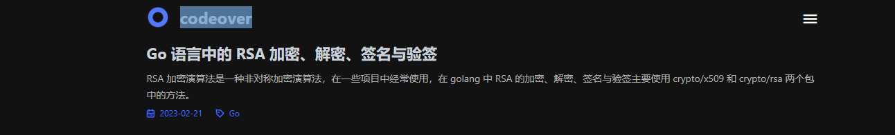

# 基本信息

:::tip

本页所有配置项均在 Hexo 配置根目录 `_config.yml` 中修改

:::

## 语言

配置项名称：`language`

博客内容语言，目前主题仅支持 `zh-CN`，请注意合理设置，否则浏览博客时浏览器会弹出翻译窗口。

## 站点地址

配置项名称：`url`

博客地址，请正确填写，以免造成一些不必要的影响。注意链接末尾不要加 `/`。

## 博文内容链接

配置项名称：`permalink`

例如，想要将文章固定链接设置为 `https://example.com/2021/01/01/hello-world.html`，则可以将 `permalink` 设置为 `:year/:month/:day/:title.html`。

可选变量列表：

| 可选值           | 描述                                      |
|---------------|-----------------------------------------|
| `:year`       | 文章的发表年份（4 位数）                           |
| `:month`      | 文章的发表月份（2 位数）                           |
| `:i_month`    | 文章的发表月份（去掉开头的零）                         |
| `:day`        | 文章的发表日期 (2 位数)                          |
| `:i_day`      | 文章的发表日期（去掉开头的零）                         |
| `:hour`       | 文章发表时的小时 (2 位数)                         |
| `:minute`     | 文章发表时的分钟 (2 位数)                         |
| `:second`     | 文章发表时的秒钟 (2 位数)                         |
| `:title`      | 文件名称 (相对于 “source/_posts/“ 文件夹)         |
| `:name`       | 文件名称                                    |
| `:post_title` | 文章标题                                    |
| `:hash`       | 文件名（与 :title 相同）和日期的 SHA1 哈希值（12位16进制数） |
| `:layout`     | 文章布局模板                                  |
| `:title`      | 文章标题                                    |
| 随意            | 代表固定内容                                  |

## 标题

配置项名称：`title`

站点标题，显示在网页标题栏。



## 网站描述

配置项名称：`description`

网站简要描述，主要用于 SEO 优化，文章内的 `description` 会优先于此配置。

## 网站关键词

配置项名称：`keywords`

网站关键词，主要用于 SEO 优化，文章内的 `keywords` 会优先于此配置。


## 首页设置

配置项名称：`index_generator`

### 首页文章数量

配置项名称：`index_generator.per_page`

首页文章数量，设置为 `0` 则显示所有文章。

### 首页文章排序

配置项名称：`index_generator.order_by`

首页文章排序，可选值参考 [博文内容链接](#博文内容链接)，请注意去除 `:`，例如，想要按照文章发表日期倒序排序，则可以将 `order_by` 设置为 `-date`，正序排序则设置为 `date`。


## 代码高亮

配置项名称：`highlight` 与 `prismjs`

从 Hexo5.0 版本开始自带了 [prismjs](https://prismjs.com/download.html) 代码语法高亮的支持，本主题对此进行了改造支持。

如果你的博客中曾经安装过 [hexo-prism-plugin](https://github.com/ele828/hexo-prism-plugin) 插件，那么你须要执行 `npm uninstall hexo-prism-plugin` 来卸载掉它，否则生成的代码中会有 `&#123;` 和 `&#125;` 的转义字符。

然后，修改 Hexo 根目录下 `_config.yml` 文件中 `highlight.enable` 的值为 `false`，并将 `prismjs.enable` 的值设置为 `true`，示例如下：

```yml title="_config.yml"
highlight:
  // highlight-next-line
  enable: false
  line_number: true
  auto_detect: false
  tab_replace: ''
  wrap: true
  hljs: false
prismjs:
  // highlight-next-line
  enable: true
  preprocess: true
  line_number: true
  tab_replace: ''
```

主题中默认的 `prismjs` 主题是 [Tomorrow Night](https://prismjs.com/download.html#themes=prism-tomorrow)，如果你想定制自己的主题，可以前往 [prismjs 下载页面](https://prismjs.com/download.html) 定制下载自己喜欢的主题 `css` 文件，然后将此 `css` 主题文件取名为 `prism.css`，替换掉 `hexo-theme-minimalism` 主题文件夹中的 `source/style/prism.css` 文件即可。

:::caution

修改配置文件后，务必清除缓存使配置生效：

```bash npm2yarn
npm run clean
```

:::
