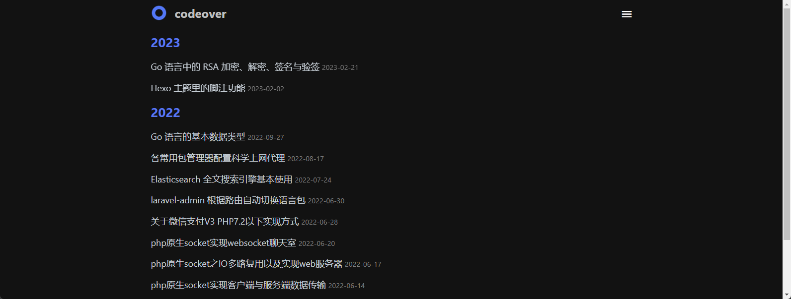

# 归档页

归档页与分类页类似，不过是通过发布时间分组

## 效果



## 配置


### 1. 创建分类页面

如果在你的博客 source 目录下还没有 `active/index.md` 文件, 那么你就需要新建一个, 命令如下:

```bash npm2yarn
npx hexo new page "active"
```

### 2. 导航栏添加标签页面

在 Minimalism 主题配置文件 `_config.minimalism.yml` 的 [navbar 配置项](/docs/config/navbar) 里面启用归档页。

```markdown title="_config.minimalism.yml"
menu:
  active:
# highlight-start
    url: "/active/"
    External: false
    name: 归档
# highlight-end
```

### 3. 修改标题（可选）

编辑 `/source/active/index.md` 文件，修改 `title` 为你想要的标题。

```markdown title="source/tags/index.md"
---
# highlight-next-line
title: 归档 # 你欲修改的标题
date: 2022-04-26 22:59:30
type: "active"
layout: "active"
---
```
