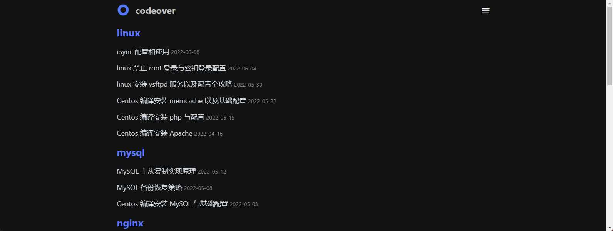

# 分类

## 效果




## 配置

### 1. 创建分类页面

如果在你的博客 source 目录下还没有 `categories/index.md` 文件, 那么你就需要新建一个, 命令如下:

```bash npm2yarn
npx hexo new page "categories"
```

### 2. 导航栏添加标签页面

在 Minimalism 主题配置文件 `_config.minimalism.yml` 的 [navbar 配置项](/docs/config/navbar) 里面启用分类。

```markdown title="_config.minimalism.yml"
menu:
  categories:
# highlight-start
    url: "/categories/"
    External: false
    name: 分类
# highlight-end
```

### 3. 修改标题（可选）

编辑 `/source/categories/index.md` 文件，修改 `title` 为你想要的标题。

```markdown title="source/tags/index.md"
---
# highlight-next-line
title: 分类列表 # 你欲修改的标题
date: 2022-04-26 22:59:30
type: "categories"
layout: "categories"
---
```
