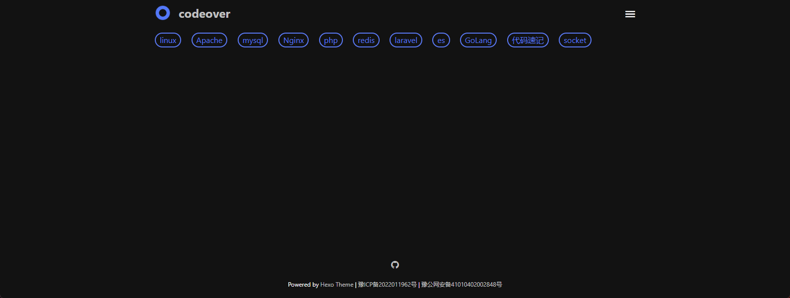

# 标签页

tags 页是用来展示所有标签的页面

## 1. 创建标签页面

如果在你的博客 source 目录下还没有 tags/index.md 文件, 那么你就需要新建一个, 命令如下:

```bash npm2yarn
npx hexo new page "tags"
```

## 2. 导航栏添加标签页面

在 Minimalism 主题配置文件 `_config.minimalism.yml` 的 [navbar 配置项](/docs/config/navbar) 里面启用 tags。

```markdown title="_config.minimalism.yml"
menu:
  tags:
# highlight-start
    url: "/tags/"
    External: false
    name: 标签
# highlight-end
```

## 3. 修改标题（可选）

编辑 `/source/tags/index.md` 文件，修改 `title` 为你想要的标题。

```markdown title="source/tags/index.md"
---
# highlight-next-line
title: 标签列表 # 你欲修改的标题
date: 2022-04-26 22:59:30
type: "tags"
layout: "tags"
---
```




