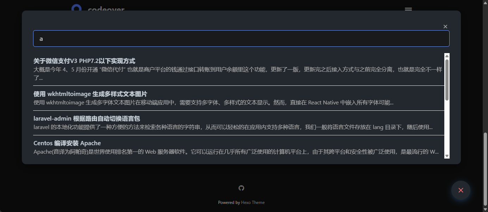
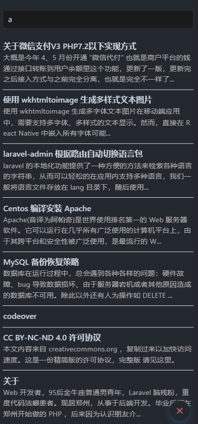

# 全文搜索功能

自 1.4.4 版本起，主题内置了全文搜索功能，支持两种实现方式，下面将分别介绍。

## 效果展示

桌面端预览：



移动端预览：



---

## 方式一：hexo-generator-search（本地搜索）

这是一个 Hexo 插件，基于 [lunr.js](https://lunrjs.com/) 实现本地全文搜索功能。

### 安装插件

```bash
npm install hexo-generator-search --save
```

### 配置步骤

**1. 修改主题配置文件 `_config.minimalism.yml`：**

```yaml
# 全文搜索配置
search:
  enable: true       # 是否启用搜索
  type: json         # 搜索类型：json 或 algolia
  placeholder: 输入关键词搜索...
```

**2. 修改 Hexo 根目录下的 `_config.yml`：**

```yaml
search:
  path: search.json  # 输出的搜索数据路径
  field: post        # 搜索范围，可选值：post、page、all
  content: true      # 是否包含正文内容
  template: ./search.xml
```

---

## 方式二：Algolia（云端搜索）

这是一个第三方搜索服务，适用于内容较多或希望加快搜索响应速度的场景。实现依赖于 [Algolia](https://www.algolia.com/) 提供的服务。

### 配置步骤

1. 访问 Algolia 官网，注册账号并添加你的站点。
2. 获取以下三个必要信息：

    * `appID`
    * `apiKey`
    * `indexName`
3. 修改主题配置文件 `_config.minimalism.yml`：

```yaml
search:
  enable: false         # 是否启用搜索（使用 Algolia 时建议为 true）
  type: algolia         # 搜索类型：json 或 algolia
  placeholder: 输入关键词搜索...
  algolia:
    appID: ''           # 替换为你的 appID
    apiKey: ''          # 替换为你的搜索专用 apiKey（非 Admin Key）
    indexName: ''       # 替换为你的索引名称
```

---

如需在本地和云端之间切换，只需修改 `type` 和相关配置即可。建议根据站点规模和访问需求选择合适的方式。

